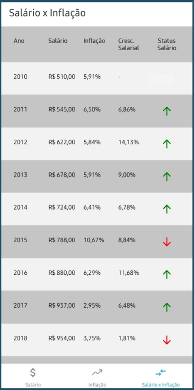

# Salário e Inflação - Comparativo




Esta é uma aplicação React Native que apresenta a comparação do salário mínimo com a inflação ao longo dos anos no Brasil. Esta aplicação apresenta os dados de salário e inflação ano a ano e também uma comparação entre ambos.

## Instalação

Antes de executar o projeto, você precisará instalar todas as dependências necessárias. Faça isso executando:

```
npm install
```

Após a instalação, você pode iniciar o projeto executando:

```
npm start
```

## Recursos

A aplicação é composta por três abas:

- Salário: Apresenta o salário mínimo de cada ano desde 2010.
- Inflação: Mostra a taxa de inflação de cada ano desde 2010.
- Salário x Inflação: Compara o crescimento do salário mínimo e a inflação ao longo do tempo.

## Dependências

Este projeto utiliza as seguintes dependências:

- react-navigation: Uma solução de navegação completa para aplicações React Native.
- react-native-vector-icons: Conjunto personalizável de ícones para React Native.

## Contribuição

Fique à vontade para contribuir para este projeto. Se você tiver uma feature que gostaria de adicionar, por favor, abra um Issue e um Pull Request!

## Licença

Este projeto está sob a licença MIT. Consulte o arquivo [LICENSE](LICENSE) para obter detalhes.

## Contato

Se você tiver alguma dúvida ou sugestão, sinta-se à vontade para entrar em contato!
